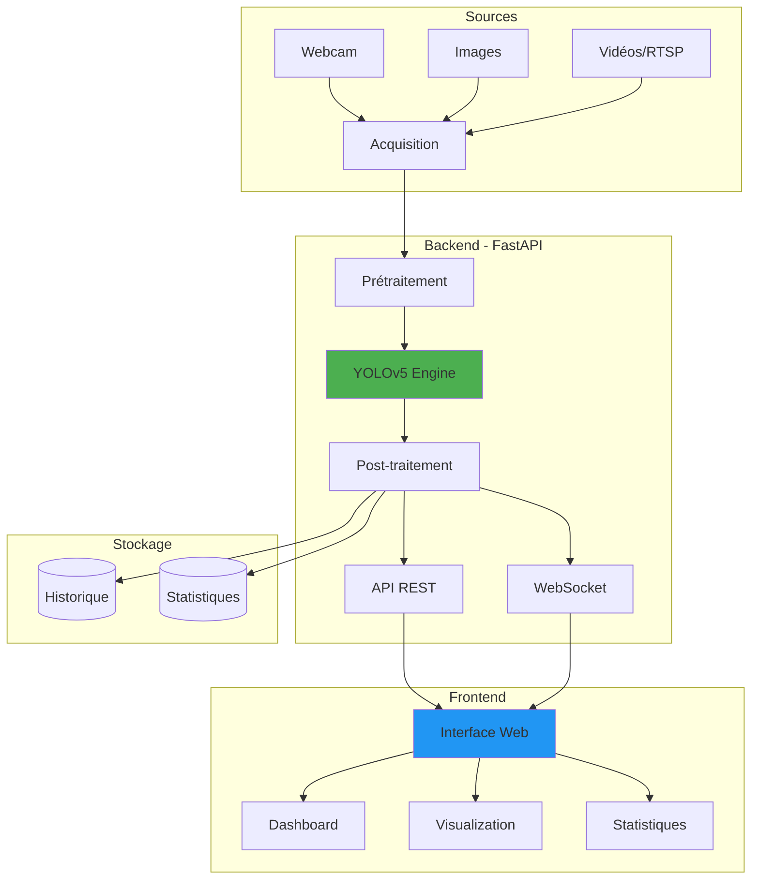
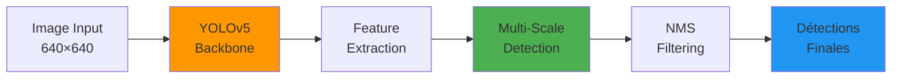
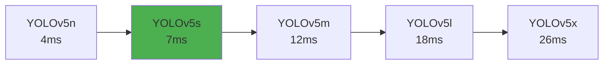
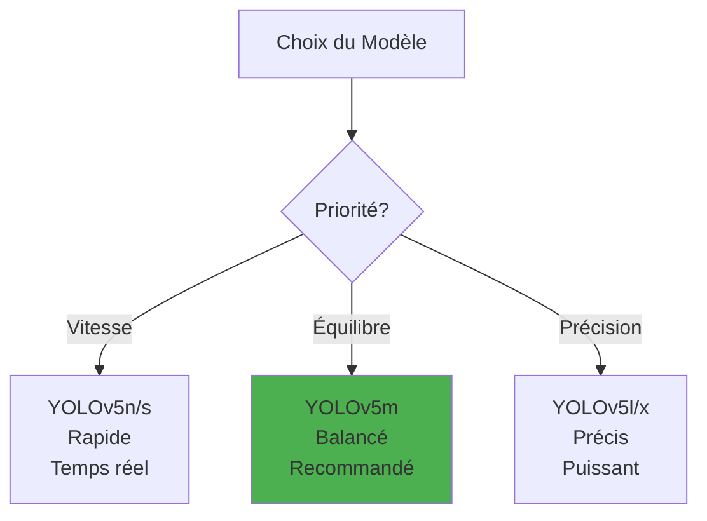
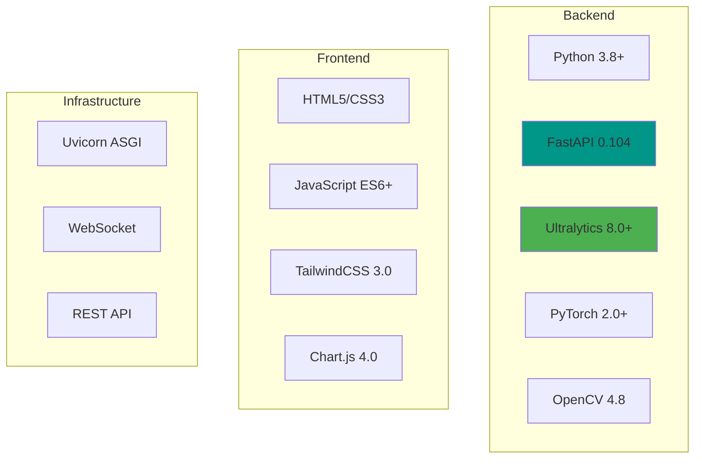

# ZKA Detection - Système Intelligent de Gestion des Flux

<div align="center">


**Système de détection d'objets en temps réel pour la gestion des flux dans les marchés d'Abidjan**

[🚀 Démo Complete](https://huggingface.co/spaces/root16285/zka-detection-full) • [📸 Démo Simple](https://huggingface.co/spaces/root16285/zka-detection) • [📖 Documentation](#documentation)

</div>

---

## Table des matières

- [Aperçu](#aperçu)
- [Fonctionnalités](#fonctionnalités)
- [Architecture](#architecture)
- [Démos en ligne](#démos-en-ligne)
- [Performances](#performances)
- [Installation](#installation)
- [Contributeurs](#contributeurs)
- [License](#license)

---

## Aperçu

**ZKA Detection** est un système intelligent de détection d'objets conçu spécifiquement pour surveiller et gérer les flux de personnes et véhicules dans les marchés d'Abidjan. Basé sur YOLOv5, il offre une détection en temps réel avec une interface web moderne et intuitive.

### Objectifs

- Détection d'objets en temps réel (webcam, images, vidéos)
- Interface web responsive et moderne
- Support multilingue (Français/Anglais)
- Statistiques et historique des détections
- Déploiement cloud sur Hugging Face Spaces
- API REST complète pour intégrations tierces

### Contexte

Les marchés d'Abidjan accueillent quotidiennement des dizaines de milliers de personnes, générant des défis de gestion de flux, de sécurité et de congestion. Ce project apporte une solution technologique basée sur l'IA pour optimizer la gestion de ces escapes publics.

---

## Fonctionnalités

### Détection en Temps Réel

- **Webcam** : Détection via flux webcam avec overlay des résultats
- **Upload d'images** : Analyze d'images individuelles ou par lot
- **Vidéos** : Support des flux RTSP et fichiers vidéo
- **Ajustable** : Seuil de confiance et sélection du modèle

### Dashboard Interactif

- **Statistiques en direct** : Comptage des objects détectés
- **Graphiques** : Visualization de la distribution des classes
- **Historique** : Archive des détections avec timestamps
- **Performances** : Monitoring FPS et temps de traitement

### API REST

- **Endpoints** : `/detect`, `/statistics`, `/history`, `/models`
- **WebSocket** : Communication bidirectionnelle pour temps réel
- **Documentation** : Swagger UI intégré (`/docs`)

### Interface Moderne

- Design responsive (mobile/desktop)
- Multilingue (FR/EN)
- TailwindCSS + Chart.js
- Mode sombre/clair

---

## Architecture

### Architecture Système



### Pipeline de Détection



### Classes Détectées

Le modèle pré-entraîné COCO détecte **80 classes** incluant :

| Catégorie | Examples | Utilité |
|-----------|----------|---------||
| **Personnes** | Piétons, foules | Comptage de flux, densité |
| **Véhicules** | Voitures, motos, bus, vélos | Gestion circulation |
| **Objects** | Sacs, valises, parapluies | Suivi logistique |
| **Infrastructure** | Bancs, chaises, tables | Cartographie |
| **Marchandises** | Fruits, objects divers | Activité commerciale |

---

## 🚀 Démos en Ligne

### Applications Déployées

Testez le système directement sans installation :

#### **Version Complète** (Recommandé)

**🔗 [https://huggingface.co/spaces/root16285/zka-detection-full](https://huggingface.co/spaces/root16285/zka-detection-full)**

- Détection webcam en temps réel
- Upload d'images
- Dashboard statistiques
- Historique complete
- WebSocket temps réel

#### **Version Simple**

**🔗 [https://huggingface.co/spaces/root16285/zka-detection](https://huggingface.co/spaces/root16285/zka-detection)**

- Upload d'images
- Interface Gradio simplifiée
- Résultats instantanés
- Multilingue (FR/EN)

### Captures d'Écran

```
┌─────────────────────────────────────────────┐
│  Détection Webcam Temps Réel                │
├─────────────────────────────────────────────┤
│                                             │
│  [Flux vidéo avec overlays de détection]   │
│                                             │
│  Personne: 5  Voiture: 2  Vélo: 1          │
│  FPS: 24  Latence: 42ms                    │
└─────────────────────────────────────────────┘
```

---

## Performances

### Vitesse d'Inférence



### Métriques Modèle (YOLOv5s - COCO)

| Métrique         | Valeur   | Description                        |
| ---------------- | -------- | ---------------------------------- |
| **mAP@0.5**      | 56.8%    | Précision moyenne (IoU≥0.5)        |
| **mAP@0.5:0.95** | 37.4%    | Précision moyenne (IoU 0.5 à 0.95) |
| **Paramètres**   | 7.2M     | Taille du modèle                   |
| **FPS (CPU)**    | ~15 FPS  | Intel i7 @ 640px                   |
| **FPS (GPU)**    | ~140 FPS | Tesla T4 @ 640px                   |

### Comparison des Modèles



---

## Implémentation et mise en œuvre

### Environment de développement

**Stack technologique** :

- Python 3.8.10
- PyTorch 1.12.1
- FastAPI 0.104.1
- OpenCV 4.8.1

**Structure du project** :

```
projetzkad-master/
├── yolov5/              # Base YOLOv5
├── webapp/              # Application web
```

---

## Installation

### Prérequis

- Python 3.8+
- pip ou conda
- (Optionnel) GPU NVIDIA avec CUDA 11.x

### Installation Rapide

```bash
# 1. Cloner le dépôt
git clone https://github.com/votre-org/projetzkad-master.git
cd projetzkad-master

# 2. Créer un environment virtuel
python -m venv venv
source venv/bin/activate # Linux/Mac
# venv\Scripts\activate   # Windows

# 3. Installer les dépendances
pip install -r requirements.txt

# 4. Télécharger le modèle YOLOv5s
wget https://github.com/ultralytics/yolov5/releases/download/v7.0/yolov5s.pt

# 5. Lancer l'application
cd webapp/backend
python main.py
```

### Accès

Ouvrez votre navigateur sur : **http://localhost:8001**

### Docker (Alternative)

```bash
# Build et lancement
docker build -t zka-detection .
docker run -p 8001:8001 zka-detection
```

### Stack Technique



---

## Utilization

### Détection via Webcam

```python
from ultralytics import YOLO

# Charger le modèle
model = YOLO("yolov5s.pt")

# Détection webcam
model.predict(source=0, show=True, conf=0.5)
```

### Détection sur Image

```python
# Détection image unique
results = model("path/to/image.jpg")

# Afficher les résultats
results[0].show()

# Sauvegarder
results[0].save("output.jpg")
```

### API REST

```bash
# Upload et détection
curl -X POST "http://localhost:8001/detect" \
  -F "file=@image.jpg" \
  -F "confidence=0.5"

# Statistiques
curl "http://localhost:8001/statistics"

# Historique
curl "http://localhost:8001/history?limit=10"
```

---

## Contributeurs

<div align="center">

### Équipe de Développement

| Nom                                    | Contact                                                                            |
| -------------------------------------- | ---------------------------------------------------------------------------------- |
| **Albert Coulibaly** (IA)              | [@Coulibaly Nahouo Albert](https://huggingface.co/root16285)                       |
| **Ziao KOLO ISRAEL** (Développeurs)    | [@Ziao Kolo Irael](https://www.linkedin.com/in/kolo-israel-ziao-1711a9329/)        |
| **Konan Konan Romuald** (Développeurs) | [@KOnan Romuald](https://www.linkedin.com/in/konan-n-dri-romuald-konan-6347b4327/) |
| **Dembélé Madoussou** (Math)          | +225 0103736385                                                                    |

### Institution

**[ESATIC](https://esatic.ci)**  
École Supérieure Africaine des TIC  
Abidjan, Côte d'Ivoire

</div>

---

## License

Ce project est sous license **MIT** - voir le fichier [LICENSE](LICENSE) pour plus de détails.

```
MIT License

Copyright (c) 2025 ESATIC - ZKA Detection Team

Permission is hereby granted, free of charge, to any person obtaining a copy
of this software and associated documentation files (the "Software"), to deal
in the Software without restriction...
```

---

## Citation

Si vous utilisez ce project dans vos recherches, veuillez le citer :

```bibtex
@software{zka_detection_2025,
  title={ZKA Detection: Système Intelligent de Gestion des Flux},
  author={ESATIC Team},
  year={2025},
  url={https://github.com/votre-org/projetzkad-master},
  institution={École Supérieure Africaine des TIC}
}
```

---

<div align="center">

**Si ce project vous a été utile, n'hésitez pas à lui donner une étoile !**

Made with ❤️ by ESATIC Team | Abidjan, Côte d'Ivoire 🇨🇮

[🚀 Démo](https://huggingface.co/spaces/root16285/zka-detection-full) • [📖 Docs](https://github.com/votre-org/projetzkad-master/wiki) • [🐛 Report Bug](https://github.com/votre-org/projetzkad-master/issues)

</div>

_Document rédigé dans le cadre du project de fin d'études à l'ESATIC_  
_Abidjan, Décembre 2025_
